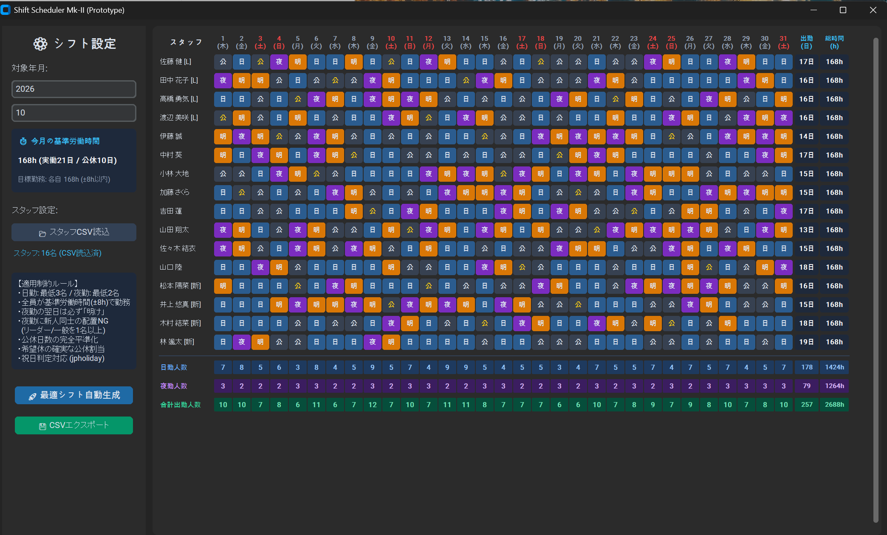

# Shift Scheduler Mk-II (数理最適化シフト自動生成デスクトップアプリ)

24時間365日稼働のチーム運用を想定した、モダンデスクトップGUI搭載のシフト自動スケジューリングツールです。  
Googleが開発した制約充足・数理最適化ソルバー **Google OR-Tools (CP-SAT)** を採用し、複雑な業務制約・スキルペアリング・労働基準法に準拠した勤務時間の平準化を一瞬で満たすシフト表を生成します。



---

## 🌟 主な特徴

- **高速かつ厳密な数理最適化:**
  - 単なる乱数・総当たりではなく、Google OR-Tools (CP-SAT Solver) を用いて数理モデル化。秒単位で制約違反ゼロの最適解を算出します。
- **モダンで視覚的なダークテーマGUI:**
  - `CustomTkinter` を採用し、洗練された操作画面と直感的なカラーパレット（日勤・夜勤・明け・公休）を実現。
- **実務に即した高度な制約条件:**
  - 24/365運用における「夜勤 ➔ 明け」インターバルの確実な担保。
  - スキルレベルを考慮したペアリング（新人同士のみの夜勤を自動回避し、リーダー/一般を必ず配置）。
  - 希望休（CSVインポート）の最優先割り当て。
- **月間総労働時間の完全平準化:**
  - 月の日数および祝日（`jpholiday` 連携）から基準労働時間を自動算定し、スタッフ間の勤務時間を寸分違わず均等配分。
- **ワンクリック入出力:**
  - スタッフ一覧・希望休のCSV読み込み、およびExcelでそのまま開けるBOM付きUTF-8 CSVエクスポートに対応。

---

## 🛠️ 技術スタック

| カテゴリ | 採用技術 | 用途 |
| :--- | :--- | :--- |
| **Language** | Python 3.10+ | メインロジック・アプリケーション基盤 |
| **GUI Framework** | CustomTkinter | モダンデスクトップUI構築 |
| **Optimization** | Google OR-Tools (CP-SAT) | シフト制約充足および時間平準化ソルバー |
| **Calendar/Data** | jpholiday, Pandas | 日本の祝日自動判定、データ処理 |
| **Packaging** | PyInstaller | 配布用スタンドアロンexe化 |

---

## 📋 業務制約モデル (Constraint Model)

1. **基本稼働枠:** 各日において「日勤 3名」「夜勤 2名」の必要配置数を厳密に充足
2. **勤務間インターバル:** 夜勤を担当した翌日は、必ず「明け」を割り当て
3. **シフト多重防止:** 各スタッフは1日につき単一の勤務区分のみ割当
4. **リスク管理（スキル制約）:** 夜勤2名体制において、新人スタッフのみの組み合わせを排除
5. **公休・時間平準化:** 基準労働時間（例: 月168時間）に対し、スタッフ間の総勤務時間を均等配分

---

## 🚀 クイックスタート

### 1. 必要ライブラリのインストール
```bash
pip install customtkinter ortools pandas jpholiday

### 2. アプリケーションの起動
bash
python main.py

### 3. 操作フロー
対象の「年・月」を指定します。

「📂 スタッフCSV読込」からスタッフ情報をインポート（未指定時はデフォルト16名で動作）。

「🚀 最適シフト自動生成」をクリックすると、OR-Toolsが制約を満たすシフトを即座に計算・描画します。

「💾 CSVエクスポート」で完成したシフト表を外部保存できます。


### 📂 CSVフォーマット仕様
```
インポート用のCSVは以下のフォーマットに対応しています。

スタッフ名,役職,希望休
佐藤 健,リーダー,"5,12"
田中 花子,一般,"3"
松本 陽菜,新人,""

### 📄 ライセンス
本プロジェクトは MIT License のもとで公開されています。

